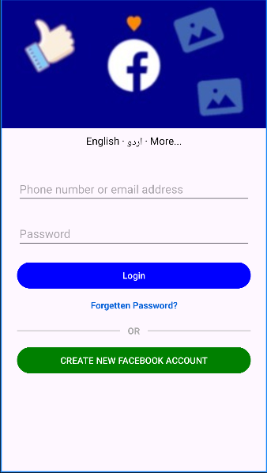

# 📘 Facebook Login UI – Android App

A simple Android application that replicates the **Facebook Login screen UI** using **Kotlin** and **XML (ConstraintLayout)**.  
This project is designed for **learning purposes**, focusing on UI design, form validation, and activity navigation.

---

## 📱 Project Overview

This app demonstrates how to build a **Facebook-style login interface** in Android.  
Users can enter an email/phone and password, validate input fields, and navigate to a welcome screen.

⚠️ **Note:**  
This project does **NOT** connect to real Facebook servers and does **NOT** perform actual authentication.

---

## ✨ Features

- 📧 Email / Phone input field
- 🔒 Password input field
- ✅ Input validation (empty field check)
- 🔁 Intent-based navigation to another activity
- 🎨 Facebook-like UI design
- 🌐 Language display (English · اردو · More...)
- 🔵 Login & 🟢 Create Account buttons

---

## 📸 Screenshots

| Login Screen |
|-------------|
|  |

> 📌 Upload your screenshots in a folder named `screenshots`

---

## 🛠️ Tech Stack

- **Language:** Kotlin
- **UI Design:** XML (ConstraintLayout)
- **IDE:** Android Studio
- **Architecture:** Activity-based
- **Min SDK:** As per project configuration

---

## 🧠 How It Works

### 🔹 MainActivity Logic
- Reads user input from `EditText`
- Checks if email or password is empty
- Shows a `Toast` if validation fails
- Passes email to `WelcomeActivity` using `Intent`

## 👤 Author

**Bilal Nazeer**  

---

## 📄 License

This project is for **educational and practice purposes only**.
